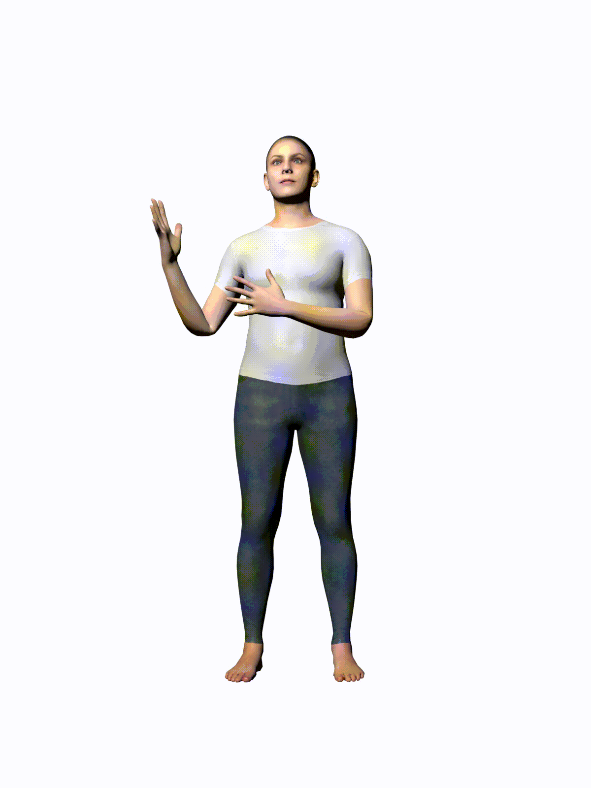
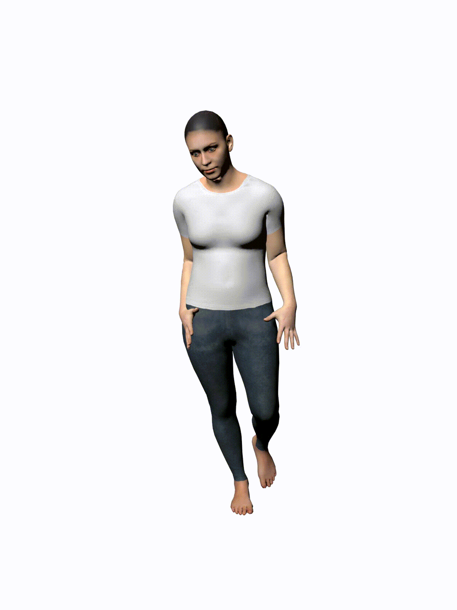
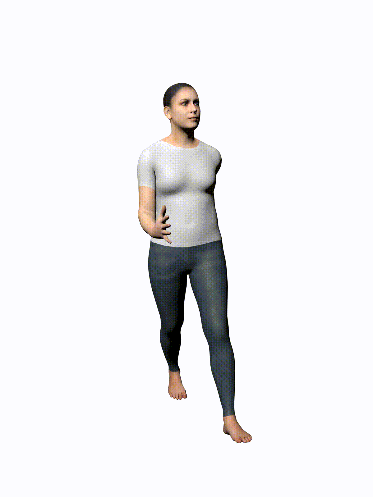
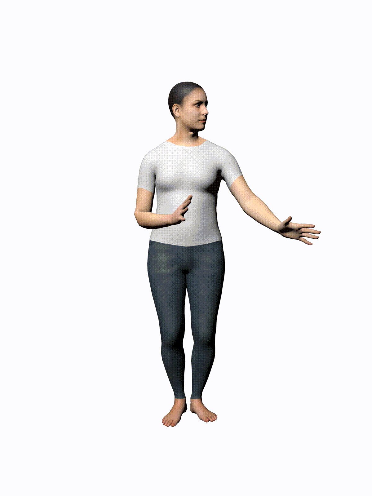

<div align="center">

<h1>MotionDiffuse: Text-Driven Human Motion Generation with Diffusion Model</h1>

<div>
    <a href='https://scholar.google.com/citations?user=2QLD4fAAAAAJ&hl=en' target='_blank'>Mingyuan Zhang</a><sup>1</sup>*&emsp;
    <a href='https://caizhongang.github.io/' target='_blank'>Zhongang Cai</a><sup>1,2</sup>*&emsp;
    <a href='https://scholar.google.com/citations?user=lSDISOcAAAAJ&hl=zh-CN' target='_blank'>Liang Pan</a><sup>1</sup>&emsp;
    <a href='https://hongfz16.github.io/' target='_blank'>Fangzhou Hong</a><sup>1</sup>&emsp;
    <a href='https://gxyes.github.io/' target='_blank'>Xinying Guo</a><sup>1</sup>&emsp;
    <a href='https://yanglei.me/' target='_blank'>Lei Yang</a><sup>2</sup>&emsp;
    <a href='https://liuziwei7.github.io/' target='_blank'>Ziwei Liu</a><sup>1+</sup>
</div>
<div>
    <sup>1</sup>S-Lab, Nanyang Technological University&emsp;
    <sup>2</sup>SenseTime Research&emsp;
</div>
<div>
    *equal contribution&emsp;
    <sup>+</sup>corresponding author
</div>

<table>
<tr>
    <td align='center' width='24%'>play the guitar</td>
    <td align='center' width='24%'>walk sadly</td>
    <td align='center' width='24%'>walk happily</td>
    <td align='center' width='24%'>check time</td>
</tr>
<tr>
    <td></td>
    <td></td>
    <td></td>
    <td></td>
</tr>
</table>

This repository contains the official implementation of _MotionDiffuse: Text-Driven Human Motion Generation with Diffusion Model_.

---

<h4 align="center">
  <a href="https://mingyuan-zhang.github.io/projects/MotionDiffuse.html" target='_blank'>[Project Page]</a> •
  <a href="https://arxiv.org/abs/2208.15001" target='_blank'>[arXiv]</a> •
  <a href="https://youtu.be/U5PTnw490SA" target='_blank'>[Video]</a> •
  <a href="https://colab.research.google.com/drive/1Dp6VsZp2ozKuu9ccMmsDjyij_vXfCYb3?usp=sharing" target='_blank'>[Colab Demo]</a>
</h4>

</div>


## Updates

[10/2022] Add a [Colab Demo](https://colab.research.google.com/drive/1Dp6VsZp2ozKuu9ccMmsDjyij_vXfCYb3?usp=sharing) for text-driven motion generation! [](https://colab.research.google.com/drive/1dfaecX7xF3nP6fyXc8XBljV5QY1lc1TR?usp=sharing)

[10/2022] Code release for text-driven motion generation!

## Text-driven Motion Generation

You may refer to [readme](text2motion/README.md) for detailed introduction.

## Citation

If you find our work useful for your research, please consider citing the paper:

```
@article{zhang2022motiondiffuse,
  title={MotionDiffuse: Text-Driven Human Motion Generation with Diffusion Model},
  author={Zhang, Mingyuan and Cai, Zhongang and Pan, Liang and Hong, Fangzhou and Guo, Xinying and Yang, Lei and Liu, Ziwei},
  journal={arXiv preprint arXiv:2208.15001},
  year={2022}
}
```

## Acknowledgements

This study is supported by NTU NAP, MOE AcRF Tier 2 (T2EP20221-0033), and under the RIE2020 Industry Alignment Fund – Industry Collaboration Projects (IAF-ICP) Funding Initiative, as well as cash and in-kind contribution from the industry partner(s).