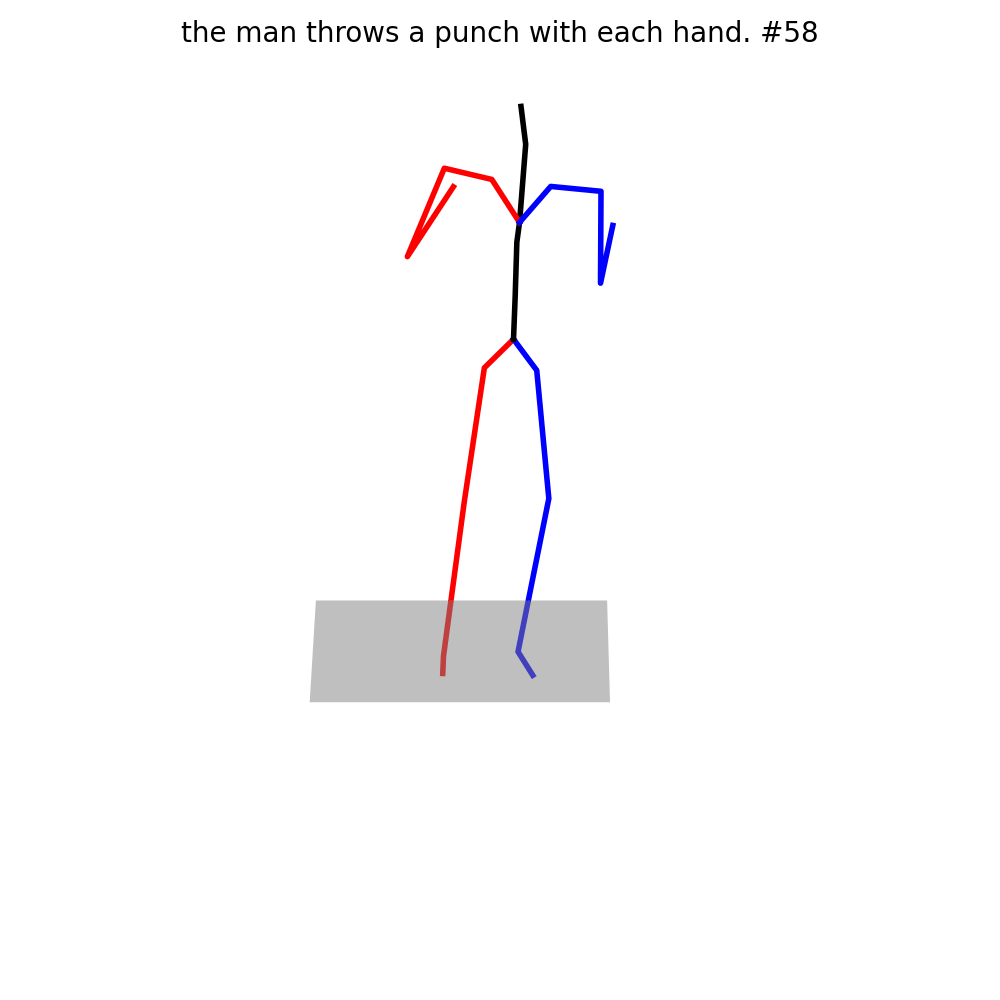
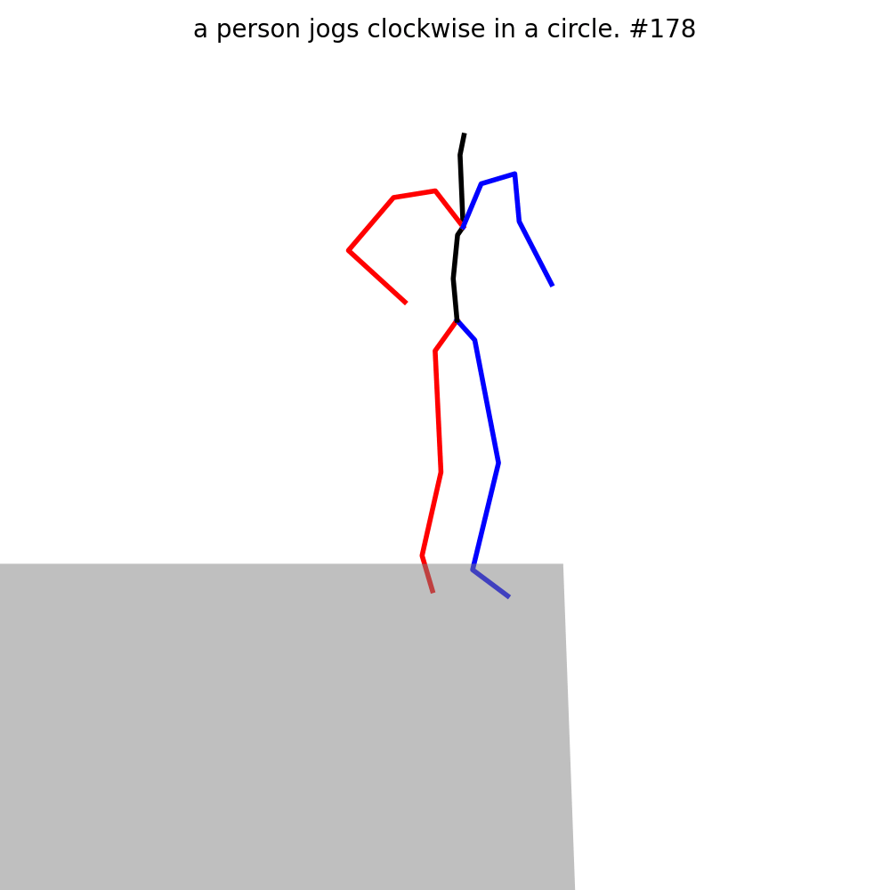
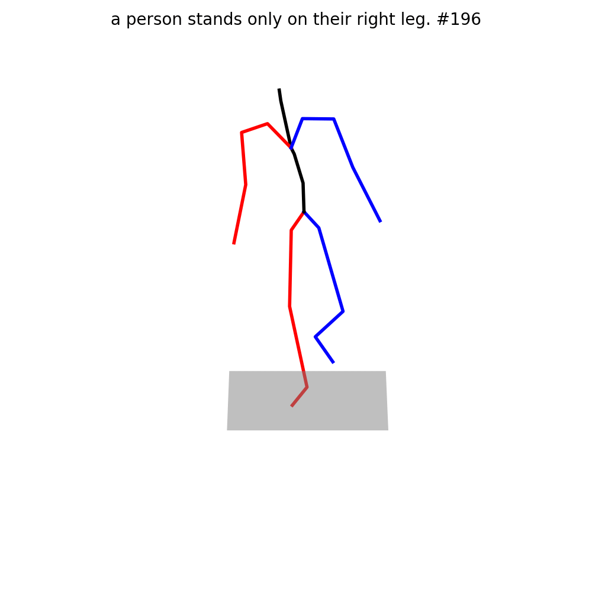
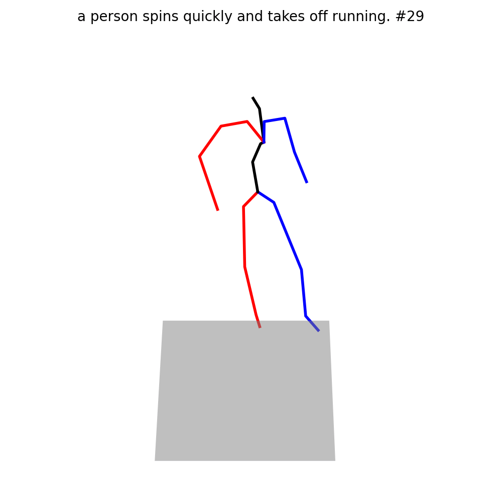
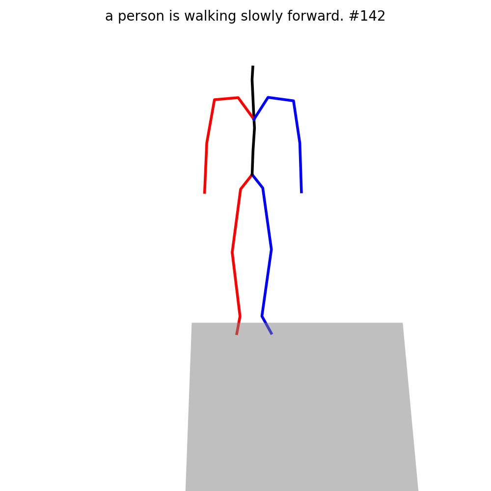
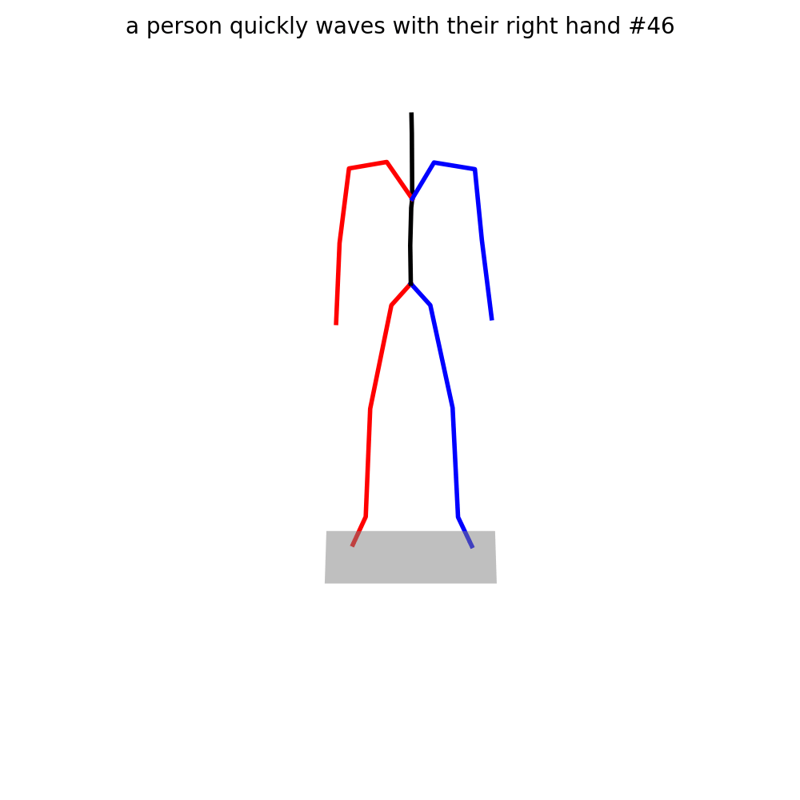
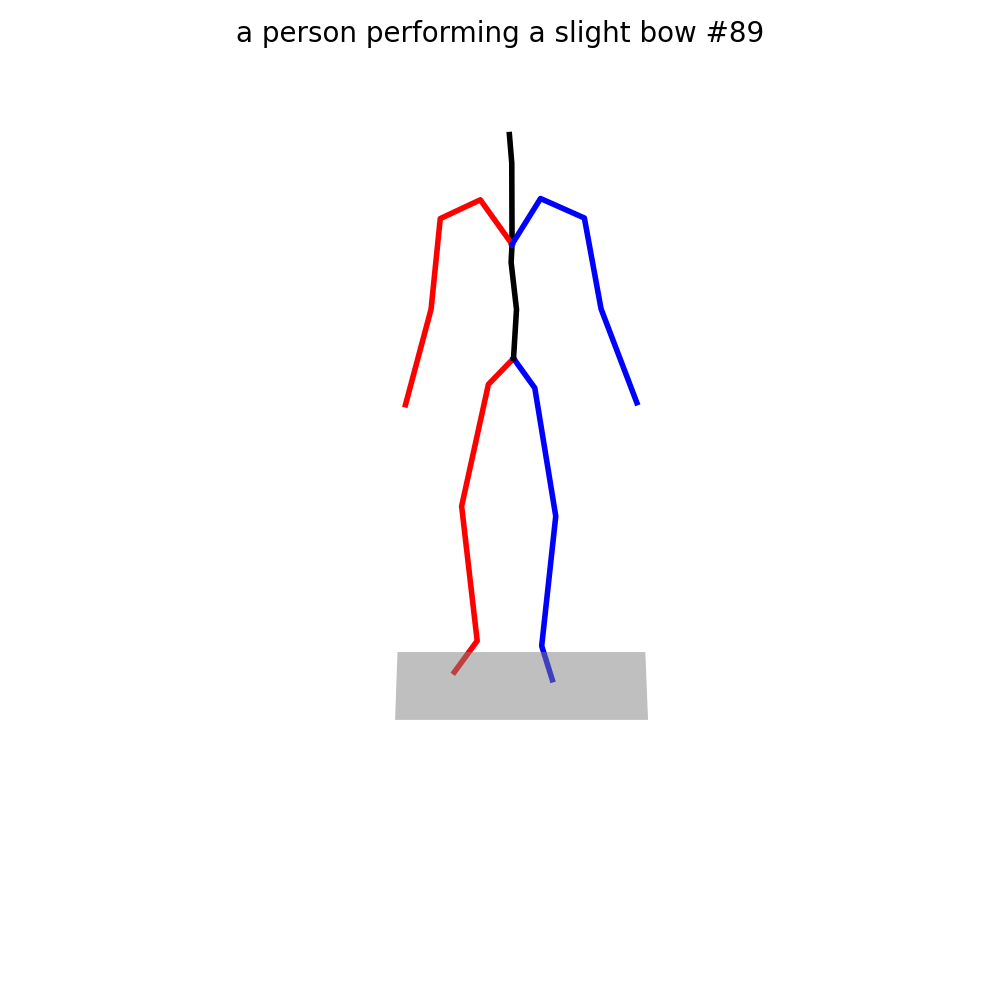
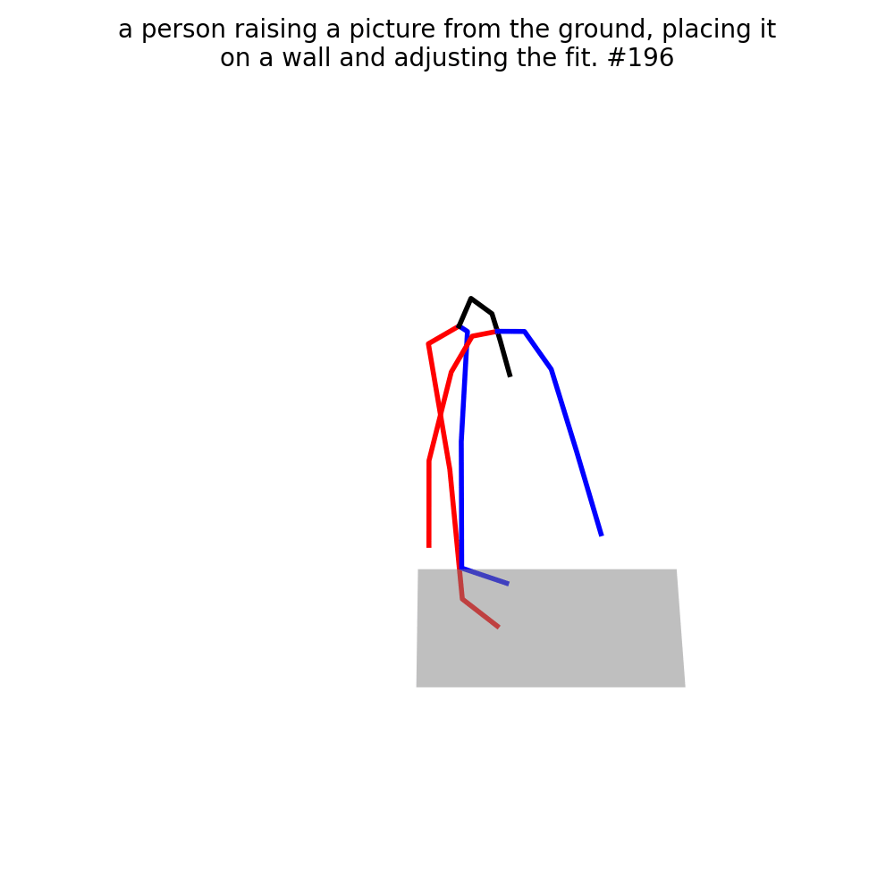

# Text-driven Motion Generation

<!-- TOC -->

- [Installation](#installation)
- [Training](#prepare-environment)
- [Acknowledgement](#acknowledgement)

<!-- TOC -->

## Installation

Please refer to [install.md](install.md) for detailed installation.

## Training

Due to the requirement of a large batchsize, we highly recommend you to use DDP training. A slurm-based script is as below:

```shell
PYTHONPATH="$(dirname $0)/..":$PYTHONPATH \
srun -p ${PARTITION} -n8 --gres=gpu:8 -u \
    python -u tools/train.py \
    --name kit_baseline_ddp_8gpu_8layers_1000 \
    --batch_size 128 \
    --times 200 \
    --num_epochs 50 \
    --dataset_name kit \
    --distributed
```

Besides, you can train the model on multi-GPUs with DataParallel:

```shell
PYTHONPATH="$(dirname $0)/..":$PYTHONPATH \
    python -u tools/train.py \
    --name kit_baseline_dp_2gpu_8layers_1000 \
    --batch_size 128 \
    --times 50 \
    --num_epochs 50 \
    --dataset_name kit \
    --num_layers 8 \
    --diffusion_steps 1000 \
    --data_parallel \
    --gpu_id 0 1
```

Otherwise, you can run the training code on a single GPU like:

```shell
PYTHONPATH="$(dirname $0)/..":$PYTHONPATH \
python -u tools/train.py \
    --name kit_baseline_1gpu_8layers_1000 \
    --batch_size 128 \
    --times 25 \
    --num_epochs 50 \
    --dataset_name kit
```

Here, `times` means the duplication times of the original dataset. To retain the number of iterations, you can set `times` to 25 for 1 GPU, 50 for 2 GPUs, 100 for 4 GPUs, and 200 for 8 GPUs.

## Evaluation

```shell
# GPU_ID indicates which gpu you want to use
python -u tools/evaluation.py checkpoints/kit/kit_motiondiffuse/opt.txt GPU_ID
# Or you can omit this option and use cpu for evaluation
python -u tools/evaluation.py checkpoints/kit/kit_motiondiffuse/opt.txt
```

## Visualization

You can visualize human motion with the given language description and the expected motion length. We also provide a [Colab Demo](https://colab.research.google.com/drive/1Dp6VsZp2ozKuu9ccMmsDjyij_vXfCYb3?usp=sharing) and a [Hugging Face Demo](https://huggingface.co/spaces/mingyuan/MotionDiffuse) for your convenience.

```shell
# Currently we only support visualization of models trained on the HumanML3D dataset. 
# Motion length can not be larger than 196, which is the maximum length during training
# You can omit `gpu_id` to run visualization on your CPU
# Optionally, you can store the xyz coordinates of each joint to `npy_path`. The shape of motion data is (T, 22, 3), where T denotes the motion length, 22 is the number of joints.

python -u tools/visualization.py \
    --opt_path checkpoints/t2m/t2m_motiondiffuse/opt.txt \
    --text "a person is jumping" \
    --motion_length 60 \
    --result_path "test_sample.gif" \
    --npy_path "test_sample.npy" \
    --gpu_id 0
```

Here are some visualization examples. The motion lengths are shown in the title of animations.

<table>
<tr>
    <td></td>
    <td></td>
    <td></td>
    <td></td>
</tr>
<tr>
    <td></td>
    <td></td>
    <td></td>
    <td></td>
</tr>
</table>

**Note:** You may install `matplotlib==3.3.1` to support visualization here.

## Acknowledgement

This code is developed on top of [Generating Diverse and Natural 3D Human Motions from Text](https://github.com/EricGuo5513/text-to-motion)